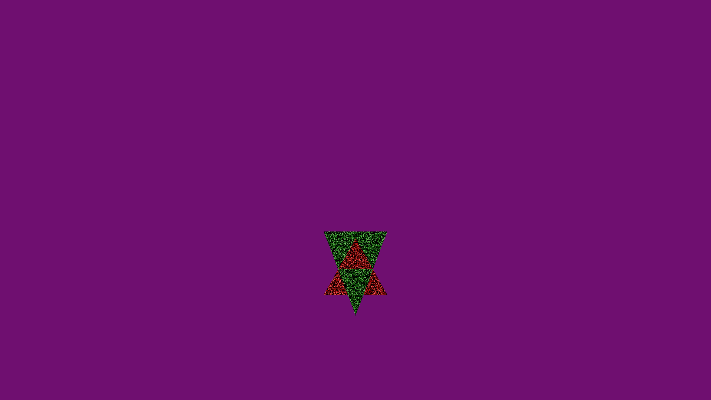
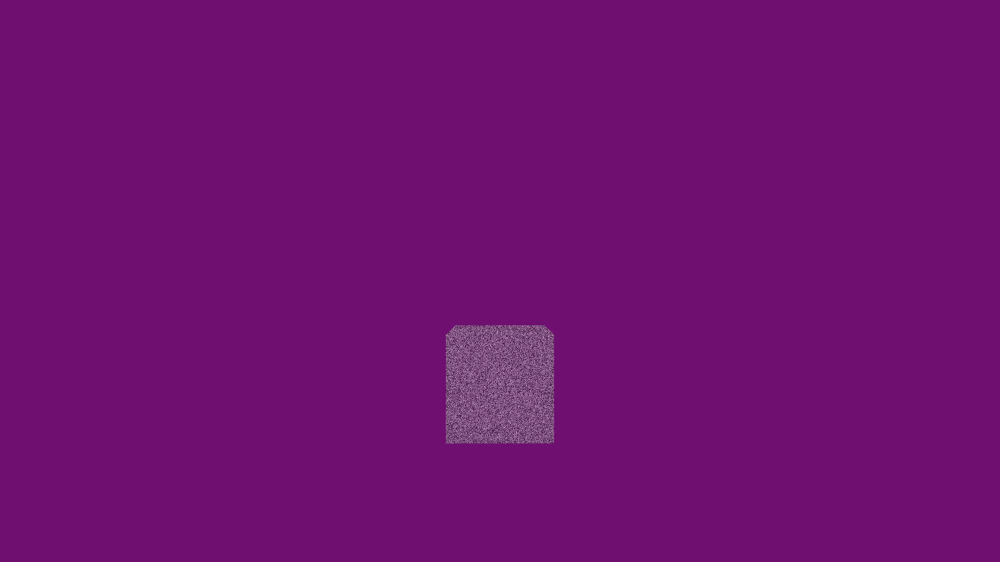
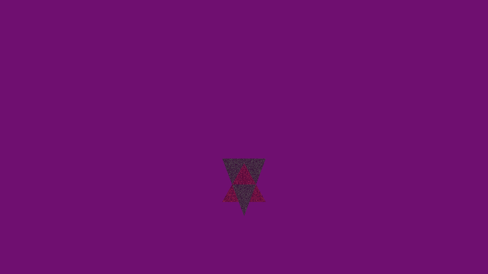

# Computer graphics in Game development course

This repo contains a template for Computer graphics in Game development labs

## Pre-requirements

- Version control: [Git](https://git-scm.com/)
- Build automation: [CMake](https://cmake.org/download/)
- C++ compiler: MSVC on Windows, Clang on MacOS, GCC on Linux (C++17 compatible)
- [OpenMP library](https://www.openmp.org/)
- Source code editor: [Visual Studio Code](https://code.visualstudio.com/Download)

For DirectX12 you need a Windows machine or VM with installed software and [Windows SDK](https://developer.microsoft.com/en-us/windows/downloads/windows-sdk/).
For graphics debugging you may to install [Microsoft PIX](https://devblogs.microsoft.com/pix/download/).

## How to build the solution

Use `git clone --recursive` to clone the repo with submodules or run `git submodule update --init --recursive` after the first clone.

Go to the project folder and run the next command:

```sh
mkdir Build
cd Build
cmake ..
```

## Third-party tools and data

- [STB](https://github.com/nothings/stb) by Sean Barrett (Public Domain)
- [Linalg.h](https://github.com/sgorsten/linalg) by Sterling Orsten (The Unlicense)
- [Tinyobjloader](https://github.com/syoyo/tinyobjloader) by Syoyo Fujita (MIT License)
- [Cxxopts](https://github.com/jarro2783/cxxopts) by jarro2783 (MIT License)
- [Cornell Box models](https://casual-effects.com/g3d/data10/index.html#) by Morgan McGuire (CC BY 3.0 License)
- [Cube model](https://casual-effects.com/g3d/data10/index.html#) by Morgan McGuire (CC BY 3.0 License)
- [Teapot model](https://casual-effects.com/g3d/data10/common/model/teapot/teapot.zip) by Martin Newell (CC0 License)
- [Dabrovic Sponza model](https://casual-effects.com/g3d/data10/index.html#) by Marko Dabrovic (CC BY-NC License)


## Performance data

### Clearing

| Num of pixels | Clear time |
|:-------------:|:----------:|
| 100x100       | 0.29 ms    |
| 1000x100      | 2.15 ms    |
| 1000x1000     | 21.2 ms    |
| 1000x10000    | 216.22 ms  |
| FullHD        | 46.38 ms   |

From experiment, performance depends on resolution linearly.


### Vertex and index buffer
- Vertex buffer size: 1632 bytes
- Index buffer size: 144 bytes
- Pure vertex buffer size: 2448 bytes
- Saving: 672 bytes

## Creative task
I have implemented a simple transparency and noise filter for rendering the object. Code changes were made mainly in resterizer_renderer.cpp.

alpha: Controls how transparent will the object be (0 - not transparent, 1 - fully transparent)
noise_amplitude: Controls the strength of the noise effect (how much it affects the color)
noise_frequency: Controls how rapidly the noise changes across the surface

Results:
```--alpha=0.5```


```--noise_amplitude=2.0 --noise_frequency=1.0```




```--noise_amplitude=2.0 --noise_frequency=1.0 --alpha=0.5```

